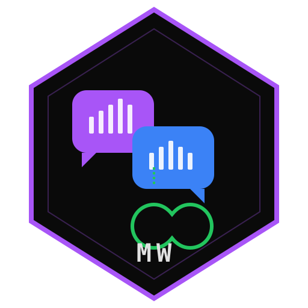

<p align="center">
  
</p>

<h1 align="center">MultiWhatsApp</h1>

<p align="center">
  <strong>Run multiple WhatsApp accounts side by side.</strong><br>
  One desktop app. Unlimited accounts. Zero limits.
</p>

<p align="center">
  
  
  
  
  
</p>

<br>

<p align="center">
  
  
  
</p>

---

## What is this?

MultiWhatsApp is a desktop client that lets you **run multiple WhatsApp Web accounts simultaneously** in a single window. Each account runs in its own isolated session — switch between them instantly with the sidebar.

No more juggling browser tabs. No more logging in and out. Just add your accounts and go.

## Features

```
 ✦ MULTI-ACCOUNT     Run unlimited WhatsApp accounts side by side
 ✦ FULL WHATSAPP     Complete WhatsApp Web experience — chats, media, calls
 ✦ NOTIFICATIONS     Desktop notifications for all accounts, even background ones
 ✦ PERSISTENT        Sessions survive restarts — no re-scanning QR codes
 ✦ ISOLATED          Each account has its own storage, cookies, and session
 ✦ CUSTOM AVATARS    Set custom profile pictures for each account tab
 ✦ UNREAD BADGES     See unread message count on each account icon
 ✦ DARK MODE         Brutalism dark theme that matches WhatsApp's dark mode
 ✦ CROSS-PLATFORM    Linux, Windows, and macOS
 ✦ LIGHTWEIGHT       ~120MB AppImage, minimal resource usage
```

## How It Works

```
┌─────────────────────────────────────────────────┐
│  MULTIWHATSAPP                        — □ ✕     │
├──┬──────────────────────────────────────────────┤
│  │                                              │
│ 🟣│                                              │
│  │         WhatsApp Web (Account 1)             │
│ 🔵│                                              │
│  │    Full chat experience — messages,          │
│ 🟢│    media, voice notes, video calls           │
│  │                                              │
│ + │                                              │
│ ⚙ │                                              │
├──┴──────────────────────────────────────────────┤
│  Each account = isolated webview + session      │
└─────────────────────────────────────────────────┘
```

Each account is an **isolated Electron webview** loading `web.whatsapp.com` with its own persistent partition. Switching accounts is instant — all webviews stay alive in the background.

## Quick Start

### Prerequisites

- [Bun](https://bun.sh) (package manager)
- [Node.js](https://nodejs.org) 20+ (for Electron)
- [Git](https://git-scm.com)

### Install & Run

```bash
# Clone
git clone https://github.com/yousef5/newWhatApp.git
cd newWhatApp

# Install dependencies
bun install

# Run in development
bun run dev
```

### First Launch

1. Click the **+** button in the sidebar
2. Scan the **QR code** with your phone (WhatsApp → Linked Devices → Link a Device)
3. Your chats load automatically
4. Add more accounts by clicking **+** again

### Build for Production

```bash
# Linux (AppImage)
bun run package:linux

# Windows (installer + portable)
bun run package:win

# macOS (DMG)
bun run package:mac
```

Output goes to the `release/` directory.

## Tech Stack

| Layer | Technology |
|-------|-----------|
| Shell | **Electron 41** — Chromium-based desktop runtime |
| Frontend | **React 19** + **TypeScript** — sidebar UI |
| Bundler | **Vite** + **electron-vite** — fast builds |
| Styling | **Tailwind CSS 4** — brutalism dark theme |
| State | **Zustand** — lightweight state management |
| WhatsApp | **WebView** — embedded WhatsApp Web per account |
| Packaging | **electron-builder** — cross-platform builds |

## Architecture

```
multiwhatsapp/
├── electron/              # Main process
│   ├── main.ts           # Window, tray, permissions, webview setup
│   ├── preload.ts        # IPC bridge (contextBridge)
│   ├── ipc/handlers.ts   # Account CRUD, config, file dialogs
│   └── storage/config.ts # Account list + app settings (~/.newwhatsapp/)
├── src/                   # Renderer (React)
│   ├── App.tsx           # App shell — sidebar + webview stack
│   ├── components/
│   │   ├── AccountSidebar/   # Account tabs with avatars + badges
│   │   ├── WhatsAppView/     # Webview component per account
│   │   ├── Settings/         # App settings overlay
│   │   └── shared/           # EmptyState
│   ├── stores/accounts.ts    # Zustand store
│   └── lib/utils.ts          # Formatters
├── shared/types.ts        # Shared TypeScript types
├── resources/             # Icons (SVG, PNG, ICO)
└── electron-builder.yml   # Build configuration
```

## Data Storage

```
~/.newwhatsapp/
├── config.json              # Account list, settings, custom avatars
└── Partitions/
    └── persist:wa-{uuid}/   # Electron webview session data per account
        ├── Cookies
        ├── Local Storage/
        └── IndexedDB/       # WhatsApp Web's own data
```

- **No custom database** — WhatsApp Web manages its own data
- **Sessions persist** across restarts
- **Each account is fully isolated** — separate cookies, storage, cache

## Account Management

| Action | How |
|--------|-----|
| Add account | Click **+** in sidebar → scan QR |
| Switch account | Click account avatar in sidebar |
| Rename account | Right-click avatar → **RENAME** |
| Custom avatar | Right-click avatar → **CHANGE AVATAR** |
| Remove account | Right-click avatar → **REMOVE ACCOUNT** |

## Keyboard Shortcuts

| Shortcut | Action |
|----------|--------|
| `Ctrl+1-9` | Switch to account 1-9 |
| `Ctrl+Tab` | Next account |
| `Ctrl+Shift+Tab` | Previous account |

## FAQ

**Q: Is this safe?**
A: Yes. It's just WhatsApp Web running inside Electron. Your messages are end-to-end encrypted by WhatsApp. We don't intercept, store, or modify any data.

**Q: Will my account get banned?**
A: No. This uses the official WhatsApp Web interface, not an unofficial API. It's the same as opening WhatsApp Web in Chrome.

**Q: How many accounts can I run?**
A: Unlimited. Each account uses ~50-100MB RAM. The practical limit is your system memory.

**Q: Do I need to keep my phone connected?**
A: No. WhatsApp Web works independently after the initial QR scan (multi-device feature).

**Q: Where is my data stored?**
A: In `~/.newwhatsapp/` on Linux/Mac, `%APPDATA%/newwhatsapp/` on Windows. Each account's WhatsApp data is in a separate Electron partition.

## Contributing

```bash
# Fork the repo
# Create your branch
git checkout -b feature/amazing-feature

# Make changes and commit
git commit -m "feat: add amazing feature"

# Push and create PR
git push origin feature/amazing-feature
```

## License

MIT — do whatever you want with it.

---

<p align="center">
  <sub>Built with Electron + React + WhatsApp Web</sub><br>
  <sub>Made by <a href="https://github.com/yousef5">yousef5</a></sub>
</p>
